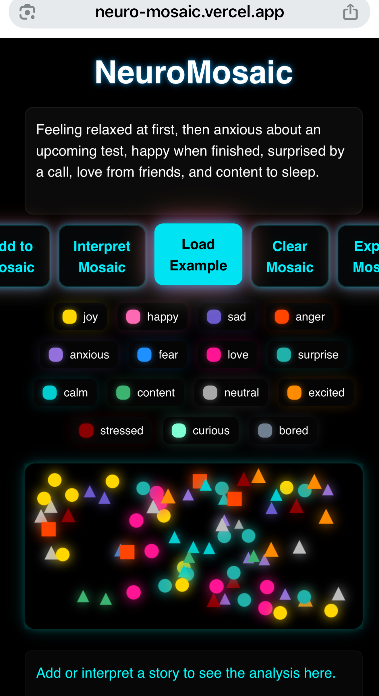

# 🌟 Anvay Rao — Projects Portfolio

Welcome to **anvayrao-projects** — a curated collection of all the apps, tools, and passion projects I’ve built in high school.  
My work focuses on community impact, AI experimentation, mobile development, and creative problem-solving.

This page serves as a single, organized link for colleges, internships, and anyone who wants to explore my projects.

---

## 🚀 Featured Projects

### 🟦 1. Arcs Hub — Community Services Platform  
A responsive **web + mobile** app built with Glide Apps to help local businesses, home-based services, and informal workers promote their services to the community.


- **Live App:** [Glide Link](https://arcs-hub.glide.page)  
- **GitHub Repo:** [arcshub](https://github.com/Vay2tracks/arcshub)  
- **Tech:** Glide Apps  
- **About:** Boosts visibility for small and unstructured local businesses.  

---

### 🗣️ 2. Eko — AI Voice Assistant  
A customizable AI-powered voice assistant built with Expo.


**To try Eko on your phone:**  
You need **Expo Go** installed. Scan the QR code below to open the app:


💡 Don’t have Expo Go? Download it here:  
[Get Expo Go on iOS](https://apps.apple.com/app/expo-go/id982107779) | [Get Expo Go on Android](https://play.google.com/store/apps/details?id=host.exp.exponent)

- **GitHub Repo:** *(add your link here)*  
- **Tech:** React Native, Expo, AI APIs  
- **About:** A customizable AI voice assistant built with Expo that can respond to voice commands. Designed as a high-school passion project to explore AI and mobile development.

---

### 🎓 3. MoodLens — AI Mood Detection & Journal App  


- **Live Site:** [MoodLens](https://moodlensml.vercel.app)  
- **GitHub Repo:** [moodlens](https://github.com/Vay2tracks/moodlens)  
- **Tech:** React.js, Vite, CSS, face-api.js (TinyFaceDetector & FaceExpressionNet), LocalStorage, Vercel  
- **About:** Tracks emotions in real-time, stores logs locally, mobile-compatible, deployed on Vercel  

---

### 🎨 4. NeuroMosaic — Neuroscience-Based Art Generator  



Creates animated mosaics representing emotions using color and motion.

- **Live Site:** [NeuroMosaic](https://neuromosaic.vercel.app)  
- **GitHub Repo:** [NeuroMosaic](https://github.com/Vay2tracks/neuromosaic)  
- **Tech:** React, JavaScript Canvas API, AI emotion analysis, CSS, GitHub, Vercel  
- **About:** Transforms emotional states into interactive visual art  

---

### 🏃‍♂️ 5. Track PR Predictor  


A frontend-only prototype that estimates running PRs based on weekly mileage and sprint intervals.

- **Live Site:** [Track PR Predictor](https://trackprpredictor.vercel.app)  
- **GitHub Repo:** [trackprpredictor](https://github.com/Vay2tracks/trackprpredictor)  
- **Tech:** React, JavaScript, CSS, SVG for UI/animations, GitHub, Vercel  
- **About:** All calculations run in-browser, visually demonstrating trends and improvements  

---

## 🧰 Technologies & Tools I Use

- **JavaScript / TypeScript**  
- **React & React Native**  
- **Expo**  
- **Vercel**  
- **Glide Apps**  
- **Firebase**  
- **AI / LLM APIs**  
- **Git & GitHub**

---

## 📄 Screenshots & Media  

```md


